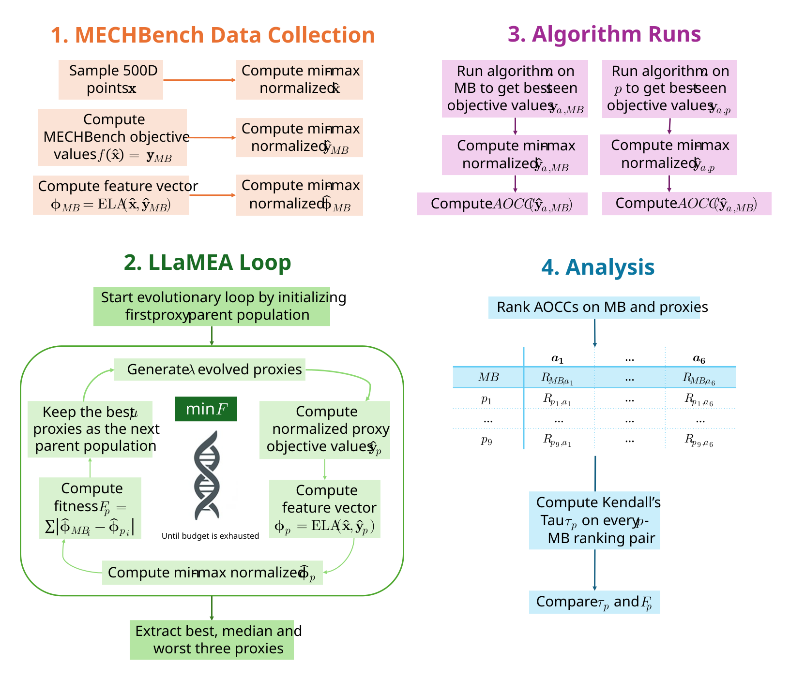

&#x20; <picture>

&#x20;   <source media="(prefers-color-scheme: light)" srcset="pipeline.svg">

&#x20;   

&#x20; </picture>

This is the codebase for the bachelor thesis "Evaluating Exploratory Landscape Analysis for Replacing Real-World Optimization Problems with LLM-generated Proxy Functions", containing all necessary files to replicate the study. The codebase consists of three main folders, each allowing replication of a main part of the study.

\## 1. MECHBench Data Collection (MECHBench)

* Sample ND points X with `sampler.py`
* Min-max normalize X
* Run simulations and compute objective values y with (`parallel.slurm` and) `main.py`
* Min-max normalize y
* Compute ELA feature vector

\## 2. LLaMEA Loop (LLaMEA\_ELA)

* Run LLaMEA loop with (`ela.slurm` and) `ELA\\\_for\\\_MECHBench.py`
* Extract proxies with `process\\\_results.py`

\## 3. Algorithm Runs (algorithm\_runs)

* Run algorithms on MECHBench problems with (`optimize\\\_on\\\_mechbench.slurm` and) `optimize\\\_on\\\_mechbench.py`
* Run algorithms on proxies with (`optimize\\\_on\\\_proxies.slurm` and) `optimize\\\_on\\\_proxies.py`

\## 4. Analysis (LLaMEA\_ELA > `process\_results.py`)

* Compute AOCCs on min-max normalized, best-seen objective values
* Rank AOCCs and compute Kendall's Tau on MB-proxy ranking pairs
* Compare Tau and Fitness scores

